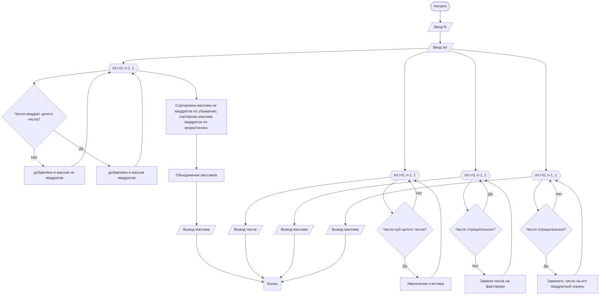

## Отчет по лабораторной работе № 2

#### № группы: `ПМ-2403`

#### Выполнил: `Клевцова Анастасия Эдуардовна`

#### Вариант: `10`

### Cодержание:

- [Постановка задачи](#1-постановка-задачи)
- [Входные и выходные данные](#2-входные-и-выходные-данные)
- [Выбор структуры данных](#3-выбор-структуры-данных)
- [Алгоритм](#4-алгоритм)
- [Программа](#5-программа)
- [Анализ правильности решения](#6-анализ-правильности-решения)

### 1. Постановка задачи
>Задача состоит в том, чтобы обработать одномерный массив целых чисел и выполнить несколько операций с ним, таких как сортировка, поиск чисел, которые являются квадратами или кубами, а также замену элементов массива.
Задачу можно разбить на несколько этапов:

- Считать с консоли число `N`, а затем `N` целых чисел и заполнить массив.
- Разместить числа в массиве так, чтобы сначала шли числа, являющиеся квадратами целых чисел, в порядке возрастания, затем остальные числа в порядке убывания.
- Найти и вывести количество чисел в массиве, которые являются кубами целых чисел.
- Вывести элементы массива, заменяя числа, являющиеся квадратами, на их квадратные корни, остальные числа оставляются без изменений.
- Заменить каждое число в массиве на его факториал (если число неотрицательное) и вывести полученный массив.
### 2. Входные и выходные данные

#### Данные на вход
На вход программа должна получать сначала число количества элементов массива, а затем сами элементы массива в количестве первого введённого числа.
|                                        |        Тип         |
|----------------------------------------|--------------------|
| Число N (количество элементов массива) | Целое число        |
| Массив из N целых чисел                | Целые числа        |

#### Данные на выход
Программа должна вывести:
- Массив после перестановки, где сначала идут квадраты целых чисел, отсортированные по возрастанию, а затем остальные числа, отсортированные по убыванию.
- Количество чисел, являющихся кубами целых чисел.
- Массив с квадратами, заменёнными на их квадратные корни.
- Массив с факториалами всех чисел (для отрицательных чисел выводится "неопределено").

|                                                                                |        Тип         |
|--------------------------------------------------------------------------------|--------------------|
| Массив после перестановки                                                      | Целые числа        |
| Количество чисел, являющихся кубами                                            | Целое число        |
| Массив с квадратами, заменёнными на их квадратные корни, и с остальными числами | Целые числа        |
| Массив с факториалами всех чисел                                               | Целые числа        |

### 3. Выбор структуры данных
- Программа получает число N типа int и массив типа long[] с размерностью N для хранения больших чисел


|                      | название переменной                                     | Тип (в Java)   | 
|----------------------|---------------------------------------------------------|--------------- |
| Массив               | array, squares, others, sortedArray                     |     int[]      |
| Факториал            | fact                                                    |     long       |
|                      | num, i, sqrt, absN, cubeCount, squaresCount, othersCount|      int       |

### 4. Алгоритм
#### Алгоритм выполнения программы:

1. **Считывание данных**
  - Считываем количество элементов массива N.
  - Считываем сами элементы массива.
2. **Разделение на квадраты целых чисел и остальные числа**
  - Массив квадратов целых чисел.
  - Массив других чисел.
3. **Сортировка чисел**
  - по возрастанию
  - по убыванию
4. **Объединение массивов**
5. **Подсчёт кубов**
  - Для каждого числа из исходного массива проверяем, является ли оно кубом целого числа.
  - Подсчитываем количество таких чисел.
4. **Замена квадратов на их квадратные корни**
5. **Вычисление факториалов и замена на них**
  - Каждое число заменяем на факториал
  - Если число отрицательное, выводим "неопределено".
  

#### Блок-схема

### 5. Программа

```java
import java.io.PrintStream;
import java.util.Scanner;
public class Main {
    public static Scanner in = new Scanner(System.in);
    public static PrintStream out = System.out;

    public static void main(String[] args) {
        // 1. Ввод массива
        out.print("Введите размер массива N: ");
        int n = in.nextInt();
        int[] array = new int[n];
        out.println("Введите " + n + " целых чисел, не превышающих 20 :");
        for (int i = 0; i < n; i++) {
            int num = in.nextInt();
            if (num > 20) {
                out.println("Число не должно превышать 20! Пожалуйста, введите другое.");
                i--;
            } else {
                array[i] = num;
            }
        }
        // 2. Сортировка массива (квадраты -> по возрастанию, остальные -> по убыванию)
        int[] squares = new int[n];
        int[] others = new int[n];
        int squaresCount = 0;
        int othersCount = 0;

        for (int i = 0; i < array.length; i++) {
            int num = array[i];
            int sqrt = (int) Math.sqrt(num);
            if (sqrt * sqrt == num) {
                squares[squaresCount++] = num;
            } else {
                others[othersCount++] = num;
            }
        }

        // Сортировка квадратов по возрастанию
        for (int i = 0; i < squaresCount - 1; i++) { //i отслеживает кол-во завершенных проходов по массиву
            for (int j = 0; j < squaresCount - 1 - i; j++) { //j отслеживает индекс текущего элемента в массиве для сравнения
                if (squares[j] > squares[j + 1]) {
                    // Обмен значений
                    int z = squares[j];
                    squares[j] = squares[j + 1];
                    squares[j + 1] = z;
                }
            }
        }
        // Сортировка остальных чисел по убыванию
        for (int i = 0; i < othersCount - 1; i++) {
            for (int j = 0; j < othersCount - 1 - i; j++) {
                if (others[j] < others[j + 1]) {
                    // Обмен значений
                    int z = others[j];
                    others[j] = others[j + 1];
                    others[j + 1] = z;
                }
            }
        }
        // Объединение отсортированных массивов
        int[] sortedArray = new int[squaresCount + othersCount];
        int index = 0;
        // Добавляем отсортированные квадраты
        for (int i = 0; i < squaresCount; i++) {
            sortedArray[index++] = squares[i];
        }
        // Добавляем остальные числа
        for (int i = 0; i < othersCount; i++) {
            sortedArray[index++] = others[i];
        }
        // Вывод объединенного массива
        System.out.println("Отсортированный массив:");
        for (int i = 0; i < sortedArray.length; i++) {
            out.print(sortedArray[i] + " ");
        }
        out.println();

        // 3. Подсчет чисел, являющихся кубами целых чисел
        int cubeCount = 0;
        for (int i = 0; i < array.length; i++) {
            int num = array[i];
            int cbrt = (int) Math.cbrt(num);
            if (cbrt * cbrt * cbrt == num) {
                cubeCount += 1;
            }
        }
        out.println("Количество чисел, являющихся кубами целых чисел: " + cubeCount);

        // 4. Замена квадратов на их квадратные корни и вывод массива
        out.println("Массив после замены квадратов на их квадратные корни:");
        for (int i = 0; i < n; i++) {
            int sqrt = (int) Math.sqrt(array[i]);
            if (sqrt * sqrt == array[i]) {
                out.print(sqrt + " ");
            } else {
                out.print(array[i] + " ");
            }
        }
        out.println();

        // 5. Замена каждого числа на его факториал и вывод массива
        out.println("Массив после замены чисел на их факториалы:");
        for (int i = 0; i < n; i++) {
            int num = array[i];
            if (num < 0) {
                out.print(num + " ");
            } else {
                long fact = 1;
                for (int j = 1; j <= num; j++) {
                    fact *= j;
                }
                out.print(fact + " ");
            }
        }
        out.println();
        in.close();
    }
}
```
### 6. Анализ правильности решения
Программа работает корректно на всем множестве решений с учетом ограничений.

1. Тест №1:

    - **Input**:
        ```
        5
        9 3 16 20 -2
        ```

    - **Output**:
        ```
        Отсортированный массив: 9 16 20 3 -2
        Количество чисел, являющихся кубами целых чисел: 0
        Массив после замены квадратов на их квадратные корни:3 3 4 20 -2
        Массив после замены чисел на их факториалы:362880 6 20922789888000 2432902008176640000 -2 

        ```
2. Тест №2:

    - **Input**:
        ```
        5
        4 7 16 10 9
        ```

    - **Output**:
        ```
        Отсортированный массив:4 9 16 10 7
        Количество чисел, являющихся кубами целых чисел: 0
        Массив после замены квадратов на их квадратные корни:2 7 4 10 3
        Массив после замены чисел на их факториалы:24 5040 20922789888000 3628800 362880 
        ```

